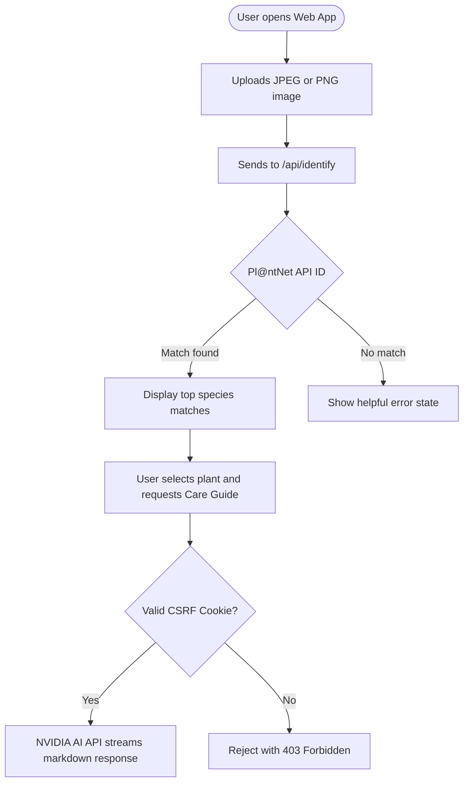
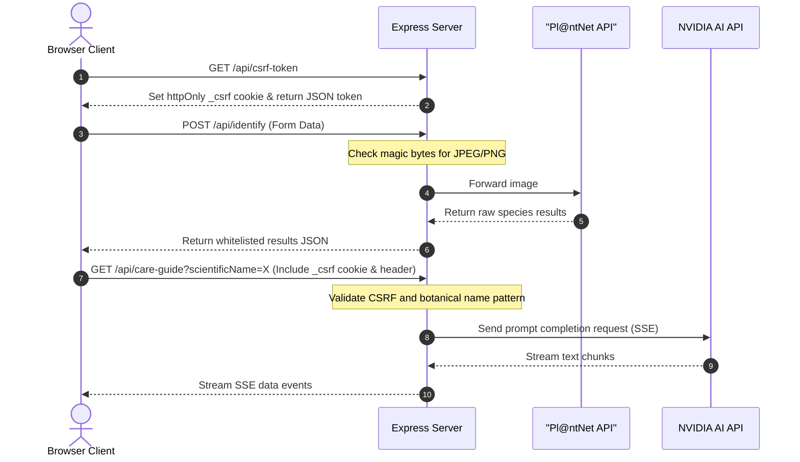

# 🌿 Plant Field Journal

A secure, retro-styled botanical field journal for identifying plants from photographs and generating streaming, AI-powered care guides.

Live Site: [https://plant.ranjansharma.info.np/](https://plant.ranjansharma.info.np/)

---

## 📸 Overview and Features

- **Identification**: Upload a plant photo (JPEG/PNG) to identify species, botanical classification, and common names.
- **AI Care Guide**: Streams detailed watering schedules, light requirements, and custom tips.
- **Retro Aesthetic**: Styled like a hand-made vintage botanical journal, complete with parchment texture, ink stains, and margin doodles.
- **Production Hardened**: Built with strict rate limiters, memory-safe token-based CSRF protection, and magic byte file signature validation.

---

## 📊 Application Workflows

### User Journey Flow



### Security and Validation Flow



---

## 🛠️ Tech Stack

- **Frontend**: Vanilla HTML5, CSS3, ES6 Javascript
- **Backend**: Express.js (Node.js runtime)
- **Security**: Helmet, Express Rate Limit, Cookie Parser
- **Streaming**: Node Native Streams (NVIDIA Chat Completion API)

---

## 🚀 Local Installation

1. **Clone the repository**:
   ```bash
   git clone https://github.com/Konseptt/plant-id-care-guide.git
   cd plant-id-care-guide
   ```

2. **Install dependencies**:
   ```bash
   npm install
   ```

3. **Configure Environment variables**:
   Create a `.env` file in the root directory:
   ```env
   PORT=3000
   NVIDIA_API_KEY=your_nvidia_api_key
   PLANTNET_API_KEY=your_plantnet_api_key
   ```

4. **Run the development server**:
   ```bash
   npm run dev
   ```

---

## ☁️ Deployment

### Render
Connect your repository to Render, configure a Node web service, and set the start command to `npm start`. Add `NODE_ENV=production` along with your API keys to the environment settings.

### Vercel
This repository contains a pre-configured `vercel.json` file. You can import the repository directly on Vercel, set your environment variables, and Vercel will deploy the serverless handler automatically.
